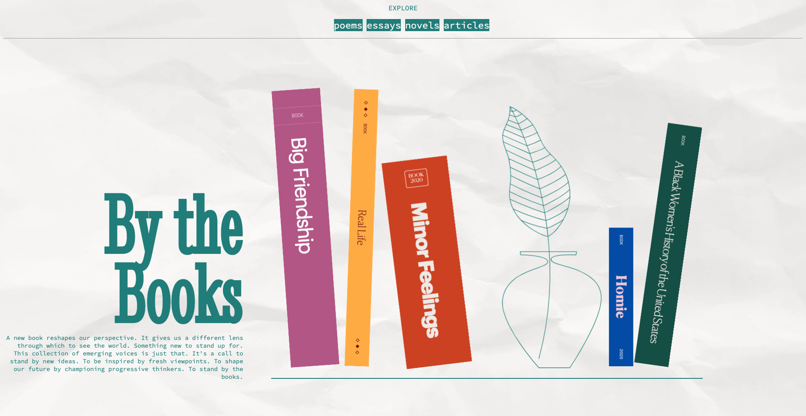

# Exercise 4

## Objectives
Practice styling the content of a webpage using CSS. When you are finished your page should look like this (the layout will vary depending on your screen size):


## Instructions
Remember to:
* Regularly save your files and check out what your web page looks like in a web browser.
* Make regular commits and pushes.
### Step 1: Get set up
* Clone your remote exercise repository onto your local machine.
* Add a comment in the head element of the homepage including: the course code and your section number - your name - Exercise 4. Example:
```
<!-- DGL 103 CVS1 - your name - Exercise 4 -->
```
### Step 2: Style the text
* Give the whole page a background-color of #f9f5f1. 
* Change the colour of all the text on the page to #207D7A.
* Go to https://fonts.google.com/ and 
  * Find the font called Source Code Pro, select the Regular 400 weight.
  * Find the font called Stint Ultra Condensed and select the Regular 400 weight.
  * Copy the link code and paste it in the head of the index file (you may need to first open the side panel by clicking on the icon of 3 squares in the top right hand corner of the main menu).
  * Copy the Source Code Pro CSS declaration and, in VS Code, apply it to all the text on the page.
  * Copy the Stint Ultra Condensed CCS declaration and, in VS Code, apply it to the h1 element.
* Change the font sizing:
  * Change the root font size to 62.5%;
  * Reduce the font size of all the text on the page to the equivalent of 16 pixels using the rem unit.
* Style the h1:
  * Increase the h1 font size to the equivalent of 200 pixels using the rem unit.
  * Reduce the line-height of the h1 to 0.8;
  * An h1 is a block element with a default margin of negative space above and below it. Remove the default margin by adding the `margin: 0;` declaration to the h1 element style.
* Make all the text in the section element align right;
* Change the font size of the paragraph in the section element to the equivalent of 14 pixels using the rem unit.
* Resize your browser window to see how the layout of the page shifts with different screen sizes. The image was given a static size of 400 pixels in the HTML. Use CSS to overwrite that dimension and change the image width to 60%, a relative unit. 
* Resize your browser window again  and notice that on a smaller screen size, the h1 gets partially hidden by the image, add a declaration to the section so that its minimum width is 300px.
* Add a background texture:
  * Use the image paper-texture.png to add a background texture to the whole page and make sure that the image cover the the whole paper
  * Resize the background image to cover the entire page, even if it has to stretch the image or cut a little bit off one of the edges (https://www.w3schools.com/cssref/css3_pr_background-size.php)

### Step 3: Add some navigation 
*  In the HTML, add a navigation list to the top of the page. Include the content shown in the provided example image.
*  Style the navigation so that it looks as close as you can get it to the navigation in the example image. 

### Step 5: Format, organize and add comments 
* Use the Prettier VSCode extension to format your code.
* The CSS is so short for this webpage that you don't need to add organizational CSS comments to make it easier to read. Instead, order your CSS style rules in the same hierarchical order as the HTML.
* Add a few comments to explain your HTML and CSS code and highlight anything of interest.

### Step 6: Check for errors
Use the VSCode HTMLHint extension and validate your code to make sure that it is correct(https://validator.w3.org/#validate_by_upload for HTML, https://jigsaw.w3.org/css-validator/ for CSS).

### Step 7: Submit your work
1. Commit your changes.
2. Push your changes to GitHub. 
3. Submit in Brightspace to the "Unit 2 Exercises" assignment and follow the instructions. 
4. If you have been using a lab computer on campus, remember to restart the computer.

## Deadlines
Assignments must be submitted before the end of the week but they will only be graded at the end of every unit. Late assignments will not be accepted and will receive an F. You can complete and submit a contract that allows you to extend the deadline for an assignment but you must email it to your instructor a minimum of 48 hrs before the deadline. Deadline extensions are only allowed for those unplanned, unexpected emergencies that life sometimes throws at us, and they will only be approved by your instructor if you follow the correct process. See the Course Info folder in BrightSpace for more info.